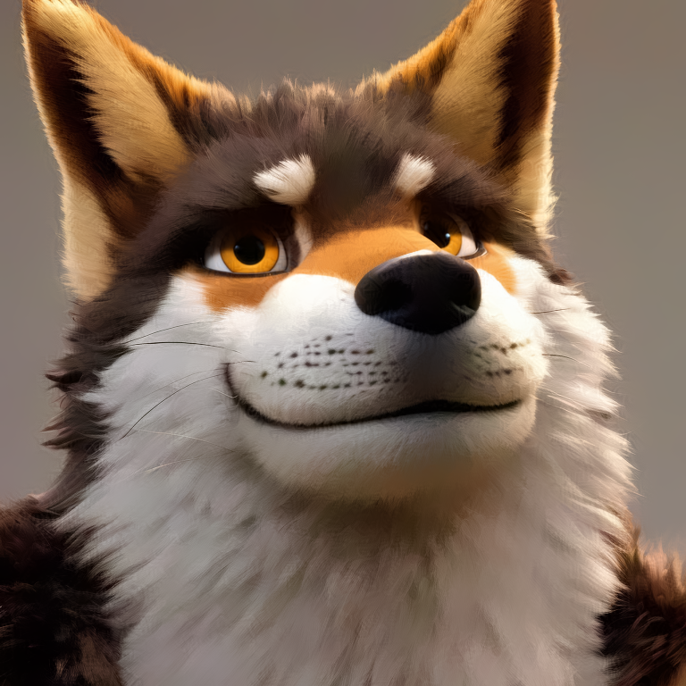

# AdverseCleaner

The shortest ever code (**16 lines of Python codes**) to remove any adversarial noise from images.

It does not even use deep learning.

And I personally think anisotropic filtering methods like this repo are more effective than training noise-removal neural networks because convolution operations are essentially non-anisotropic. 

In frequency domain, anisotropic methods are usually more “killing”.

No GPU is needed. Each 1024px image only need less than 3 seconds my laptop CPU.

# Run

    conda env create -f environment.yaml
    conda activate advc
    python clean.py

Feel free to take a look at the code to change input images.

# Result

The test image is from [here](https://twitter.com/aifurryart/status/1636208457715187714).

Input (with adversarial noise):

Output (removing adversarial noise, 2.13 second on my laptop CPU):

